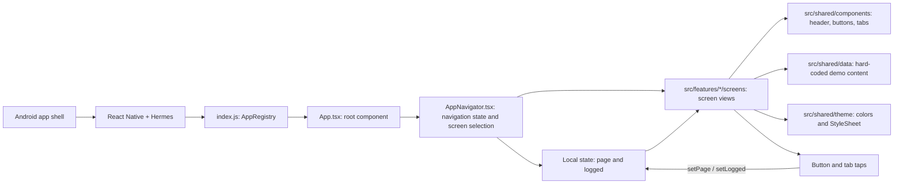
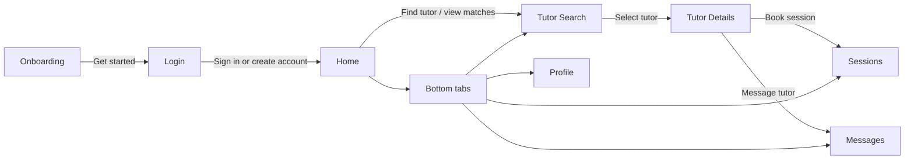

# Campus4Change prototype architecture

This is a React Native CLI prototype, not an Expo app. The Android host launches a bundled React Native application. `index.js` registers `App.tsx`, which mounts `src/navigation/AppNavigator.tsx`. The navigator selects screens using local navigation state. The app code is organized by feature, navigation, and shared resources.



## Screen flow



## What this means

- Navigation is a typed `page` value in React state, not a navigation library or Android activity per screen. Tapping a button or tab calls `setPage`; signing in also sets `logged` to `true`.
- The login fields, tutor search, profiles, sessions, and messages are UI-only examples. No API, database, authentication service, or persistent storage is connected. Demo tutor and session values live in `src/shared/data/demo.ts`.
- Shared UI is in `src/shared/components/`; colors and styles are in `src/shared/theme/`. The custom safe-area wrapper only adds Android status-bar top padding.
- `android/` is the native Android build project. The project also contains an iOS scaffold, but the prototype APK is built from Android. Hermes is enabled; the Termux build wrapper limits its APK to `arm64-v8a`, while PC builds use the normal ABI selection.
- `__tests__/App.test.tsx` checks initial rendering and the visible navigation flow through onboarding, login, home, tutor search, tutor details, sessions, messages, and profile. It does not test real authentication or backend behavior.

## Main files

| File | Role |
| --- | --- |
| `index.js` | Registers the root React Native component. |
| `App.tsx` | Root component that mounts the navigator. |
| `src/navigation/AppNavigator.tsx` | Local navigation state and screen selection. |
| `src/features/*/screens/` | Onboarding, login, home, tutor, and placeholder tab views. |
| `src/shared/components/` | Shared button, header, tabs, and status-bar safe-area wrapper. |
| `src/shared/data/demo.ts` | Static tutor, session, message, and profile values. |
| `src/shared/theme/` | Shared colors and styles. |
| `src/navigation/types.ts` | Valid page names and navigation callback type. |
| `android/` | Native Android host and Gradle APK build. |
| `package.json` | React Native CLI dependencies and npm scripts. |
| `__tests__/App.test.tsx` | Root rendering and navigation regression tests. |

This diagram describes the current prototype, not a proposed production architecture.

## Folder organization and ownership

```text
src/
├── navigation/
│   ├── AppNavigator.tsx
│   └── types.ts
├── features/
│   ├── onboarding/screens/OnboardingScreen.tsx
│   ├── auth/screens/LoginScreen.tsx
│   ├── home/screens/HomeScreen.tsx
│   ├── tutors/screens/
│   │   ├── TutorSearchScreen.tsx
│   │   └── TutorDetailsScreen.tsx
│   └── demo/screens/PlaceholderScreen.tsx
└── shared/
    ├── components/
    ├── data/demo.ts
    └── theme/
```

The navigator owns screen selection and the demonstration login state. Features
render their screens and request navigation through callbacks. A feature does
not import another feature's screen; the navigator connects them. Put components
or data used only by one feature alongside that feature when they are needed.
Keep resources used across screens in `shared/`.

The `demo` feature deliberately holds the single placeholder screen used by
Sessions, Messages, and Profile. These tabs are not separate implemented features
yet. Split them into their own feature folders when their behavior is developed.

Navigation types live beside the navigator. Screens and the shared bottom tabs
import those types only; the shared tabs do not import the navigator or feature
screens. Theme files and demo data do not depend on screens or navigation.

This structure groups related tutor screens together and keeps the root component
small without adding a navigation library, state-management framework, or backend.
The native `android/`, `ios/`, and Termux build scripts retain their existing roles.
