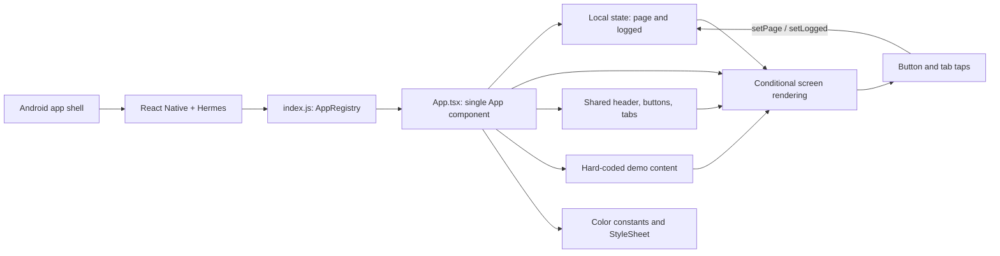
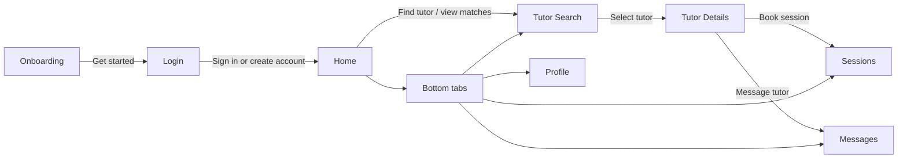

# Campus4Change prototype architecture

This is a React Native CLI prototype, not an Expo app. The Android host launches a bundled React Native application. `index.js` registers `App.tsx`, which currently contains the screens, navigation decisions, demo content, and styles in one file.

## Screen flow

## What this means

- Navigation is a `page` string in React state, not a navigation library or Android activity per screen. Tapping a button or tab calls `setPage`; signing in also sets `logged` to `true`.
- The login fields, tutor search, profiles, sessions, and messages are UI-only examples. No API, database, authentication service, or persistent storage is connected. The displayed names and sessions are hard-coded in `App.tsx`.
- The reusable `Btn`, `Tabs`, and custom `SafeAreaView` components and all styles are also in `App.tsx`. The custom safe-area wrapper only adds Android status-bar top padding.
- `android/` is the native Android build project. The project also contains an iOS scaffold, but the prototype APK is built from Android. Android is configured for `arm64-v8a` with Hermes enabled.
- `__tests__/App.test.tsx` is a single render smoke test; it does not cover navigation or business behavior.

## Main files

| File | Role |
| --- | --- |
| `index.js` | Registers the root React Native component. |
| `App.tsx` | Screens, local navigation state, shared UI, static content, and styles. |
| `android/` | Native Android host and Gradle APK build. |
| `package.json` | React Native CLI dependencies and npm scripts. |
| `__tests__/App.test.tsx` | Root-component render test. |

This diagram describes the current prototype, not a proposed production architecture.
