# TECHNOLOGICAL INSTITUTE OF THE PHILIPPINES

COLLEGE OF COMPUTER STUDIES

CS409 — Mobile Computing | CS21S2

Laboratory Activity 4.1 — Final Project Development
(React Environment Initialization and Prototype Translation) Part 1

CAMPUS4CHANGE
Splash Screen and Introduction Prototype

Prepared by:
PATRICK URBINA
JAMES SAMUEL BUNYE
XIAN IGNATIUS BEJADO
JORUSS NIÑO URBINA
MIGUEL ESCOBAR

Instructor: Mr. Juvert C. De Los Reyes
Date: October 5, 2026

Draft for group review. The original introduction-screen images still need to be added before final submission.

Honor pledge supplied in the format: “I affirm that we have not given or received any unauthorized help on this task, and that this work is our own.” Each member must review the report and the disclosed AI assistance before affirming the pledge. No signatures or independent-work claims are supplied by this document.

# 1. React Environment Initialization and Scope

Campus4Change is a campus peer-learning concept. This milestone translates its splash and introductory screens into a JavaScript React browser prototype. The four primary screens are Splash, Novice, Intermediate and Expert. Login and Sign Up are supplementary static-interface previews.

The implementation uses React and React DOM 19.2, Vite 7.3.6 as installed in the lockfile, JSX, and component-specific CSS. Development and verification were performed inside Android Termux using Node.js, npm and Chromium. This folder is a Vite project, not React Native; it does not build an APK. The separate native Android application remains unchanged.

An existing groupmate-provided project was used as the starting point. Its source was extracted from the supplied ZIP, excluding the bundled Windows node_modules folder, and dependencies were installed with npm ci. The original project and ZIP were preserved.

```text
cd splash-screen
npm ci
npm run dev -- --host 127.0.0.1
npm run lint
npm run build
```

When running the original local project, use Mobile Computing/C4C_Splash instead of splash-screen. Vite prints the preview address. The production build is generated under dist/. node_modules and dist are not included in the GitHub source submission.

```text
splash-screen/
  src/
    App.jsx
    main.jsx
    components/     reusable layouts and screen components
    hooks/          useRoute.js
    data/           slides.js
    assets/         logo, illustrations, local fonts and license
  public/
  package.json
  package-lock.json
  vite.config.js
  eslint.config.js
```

The directory structure separates reusable presentation, navigation logic, static slide content and media. App selects screens; components render them; the routing hook owns URL state. This keeps the prototype understandable without introducing a backend for this milestone.

# 2a. Source Code: Splash Timing

Figure 1 shows the effect in App.jsx that advances the splash after 3,000 milliseconds. It only runs on the splash route. Cleanup cancels the timer when the component or route changes. A second effect updates the browser title and resets the phone-frame scroll position.

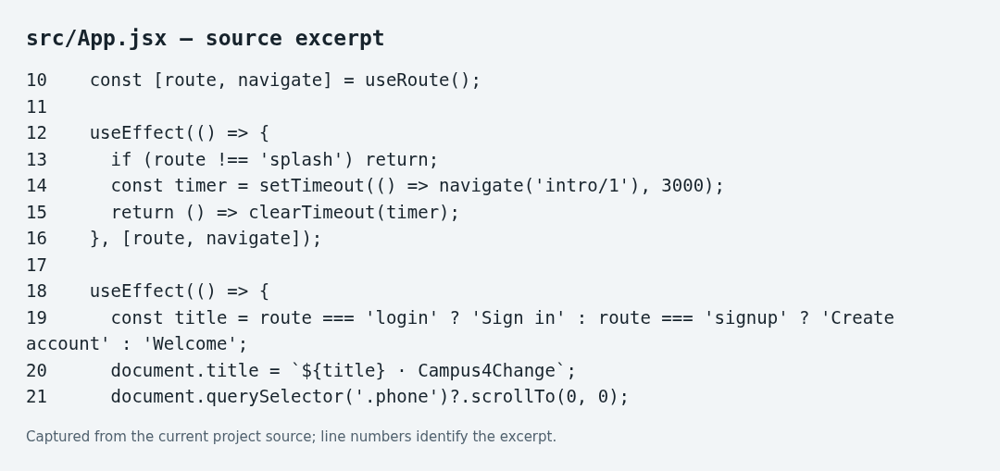

Figure 1. Actual App.jsx source excerpt.

# 2b. Source Code: Client-Side Routing

Figure 2 shows useRoute.js. Allowed hashes are splash, intro/1, intro/2, intro/3, login and signup. The hook initializes from the URL, listens for hashchange, and removes the listener during cleanup. Unknown routes fall back to the splash view. No external routing package is used.

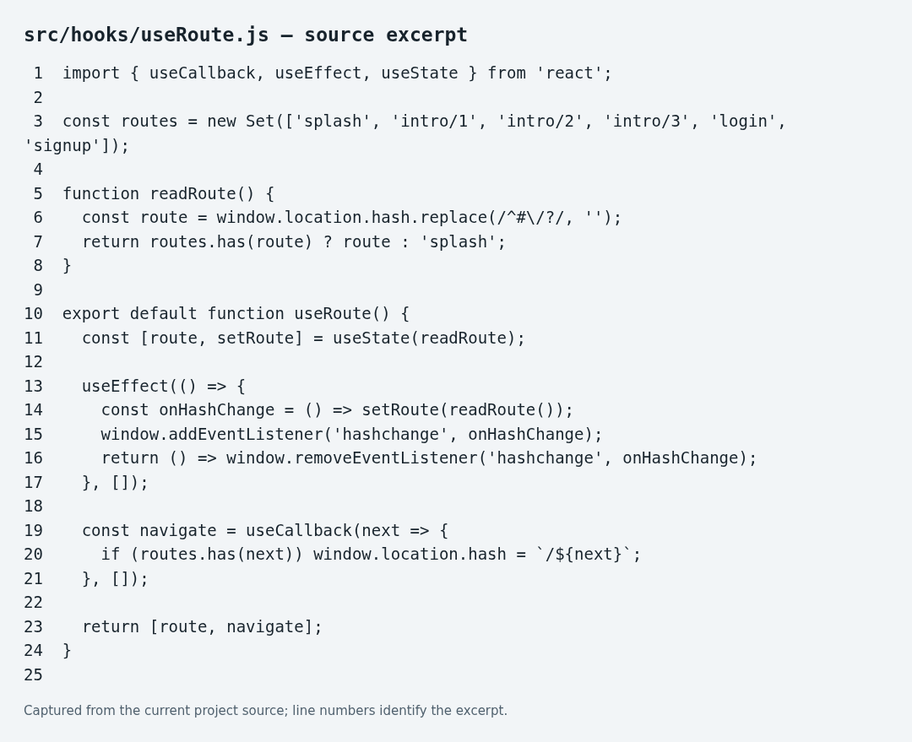

Figure 2. Actual hash-routing hook.

Hash routing supports client-side navigation, direct links, refresh and browser Back. App converts the intro route number into a zero-based slide index and passes navigation callbacks to IntroSlideshow.

# 3. Source Code: Reusable Introduction Screens

Figure 3 shows IntroSlideshow.jsx. The same screen structure is reused for all three learning levels. index determines the active slide; onSelect changes the route; onFinish opens Login. Next advances normally and becomes Get started on the final slide.

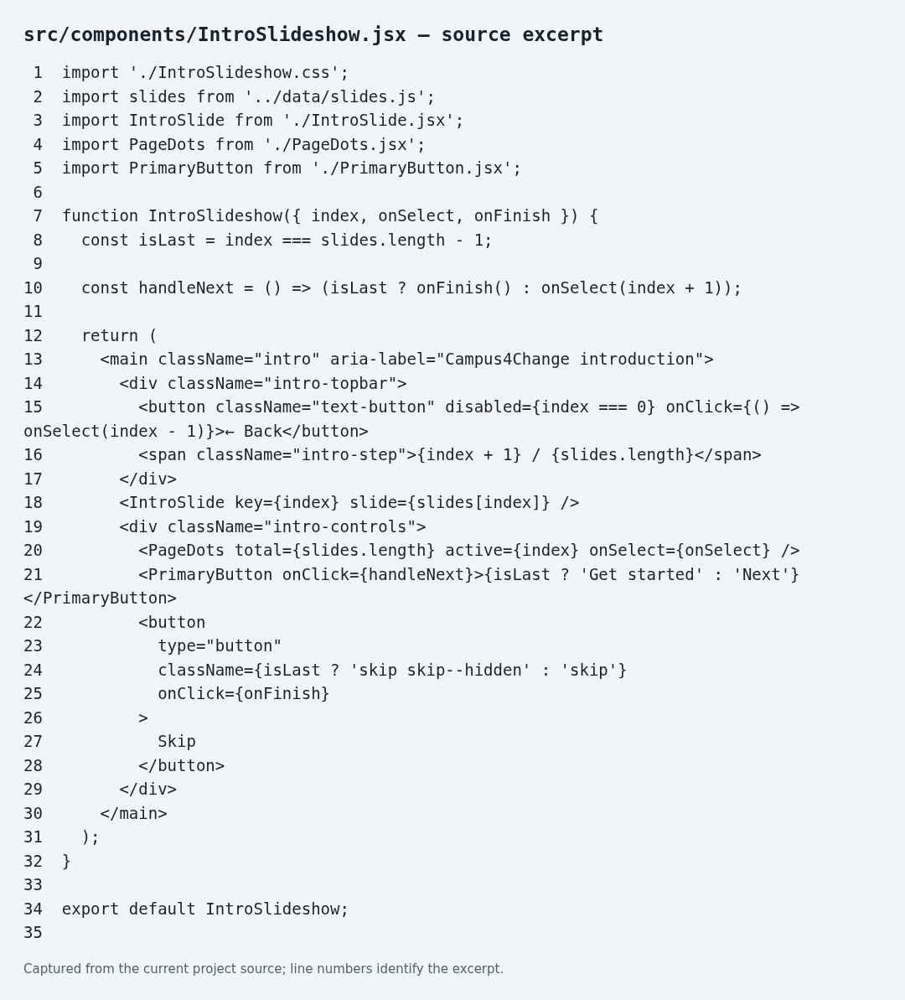

Figure 3. Actual IntroSlideshow.jsx source excerpt.

IntroSlide receives one object from data/slides.js containing the title, description, image, level and accent color. PageDots receives total and active values and lets the user choose a slide. PrimaryButton shares the main button appearance across introductions and forms. Back is hidden on the first slide; Skip is hidden on the final slide.

# 4. Source Code: Styling and Basic Responsiveness

Figure 4 shows PhoneScreenLayout.css. The desktop preview uses a 390-pixel phone frame. On narrow screens, the frame expands to the viewport width. Its height is bounded by the dynamic viewport and overflow-y enables scrolling when content exceeds the available height.

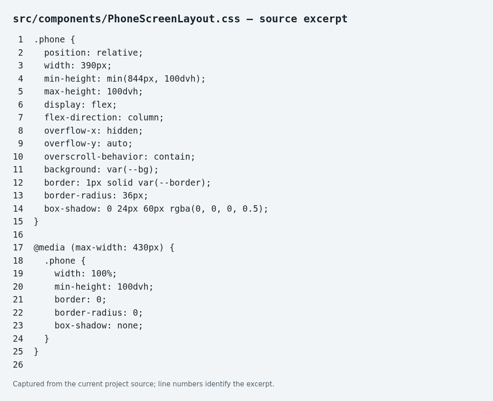

Figure 4. Actual responsive phone-frame CSS.

Shared CSS variables define the navy background (#07141c), cyan primary accent (#12c8ff), white text (#f5fafc), muted text and borders. Intro images and spacing adapt to viewport height. Inter fonts are bundled locally with their license, removing the external font-network dependency.

Accessibility support includes visible keyboard focus, descriptive image alternatives, labelled fields, form-status announcements and a prefers-reduced-motion rule. Buttons use at least 44-pixel interaction targets. These are implementation features, not a claim of a full accessibility audit.

# 5. Prototype Translation: Splash Screen Comparison

The original high-fidelity Figma screenshot is shown first, followed by the actual compiled browser screenshot. Both use a dark campus-themed palette and a prominent Campus4Change identity.

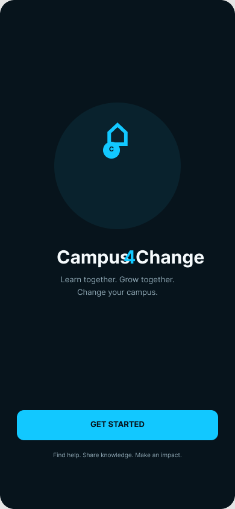

Figure 5a. Original Figma splash, node 1:2.

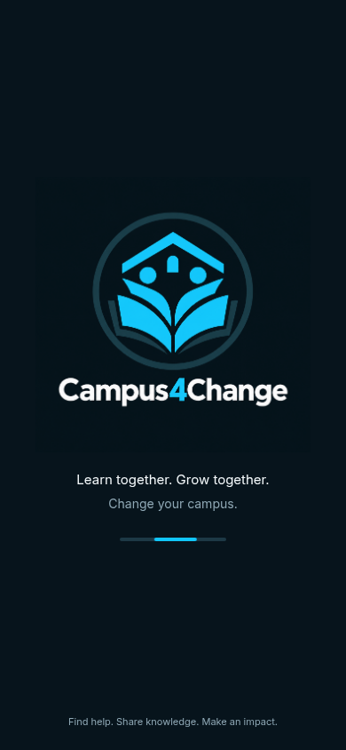

Figure 5b. Current React browser splash.

The implementation replaces the old logo with the generated book/campus/student mark and retains “Learn together. Grow together.”, “Change your campus.” and the impact-oriented footer. The image already contains the wordmark, so a second visible wordmark is not added.

Intentional differences: the original has a Get Started button, while the implementation automatically advances after three seconds and shows an animated progress indicator. The generated logo is a revised brand asset. Therefore, this is an adapted translation, not an exact pixel-for-pixel reproduction. The group should confirm that these changes are acceptable against the finalized design.

# 6. Prototype Translation: Novice Introduction

Original-design screenshot: unavailable in the retrieved evidence. Add the finalized Novice Figma frame immediately before the browser image below. A screenshot of the current implementation must not be presented as the original design.

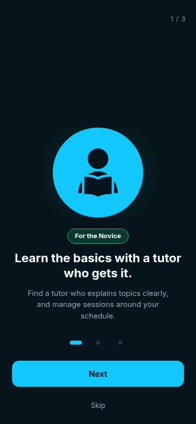

Figure 6. Actual browser output — Novice introduction.

The Novice screen introduces tutor-assisted learning. It displays the student illustration, a green level badge, the heading “Learn the basics with a tutor who gets it.” and a short explanation about managing learning sessions around the student’s schedule.

Next opens the Intermediate introduction. Skip opens Login. The selected indicator reflects slide one. Visual fidelity to the original Novice frame remains unverified until that image is supplied.

# 7. Prototype Translation: Intermediate Introduction

Original-design screenshot: unavailable in the retrieved evidence. Add the finalized Intermediate Figma frame immediately before the browser image below.

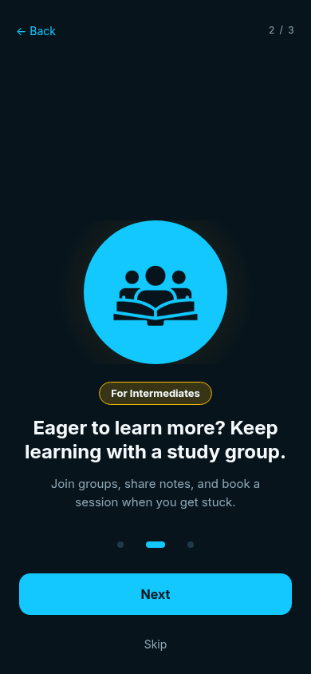

Figure 7. Actual browser output — Intermediate introduction.

The Intermediate screen emphasizes collaborative learning through study groups, shared notes and sessions. It uses the group illustration and yellow level badge while retaining the same spacing, typography and navigation components as the other introductions.

Back returns to Novice, Next opens Expert, and Skip opens Login. The middle indicator is active. The report does not claim exact design fidelity without the matching original frame.

# 8. Prototype Translation: Expert Introduction

Original-design screenshot: unavailable in the retrieved evidence. Add the finalized Expert Figma frame immediately before the browser image below.

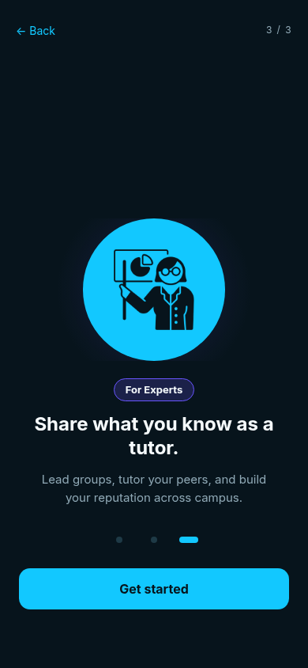

Figure 8. Actual browser output — Expert introduction.

The Expert screen invites students to share their knowledge through tutoring and group leadership. The purple level badge and teaching illustration distinguish this level while reusing the introduction layout.

Back returns to Intermediate. The final primary button reads Get started and opens Login. Skip is hidden on the final slide. Exact comparison with the original Expert frame is still pending.

# 9. Supplementary Screens: Login and Sign Up

These browser screenshots show the destinations of Skip and Get started. They are sample interfaces for this milestone, not production authentication. No original Figma comparison images for these supplementary screens were retrieved.

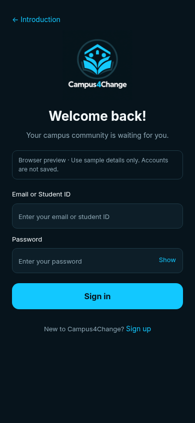

Figure 9a. Actual browser Login screen.

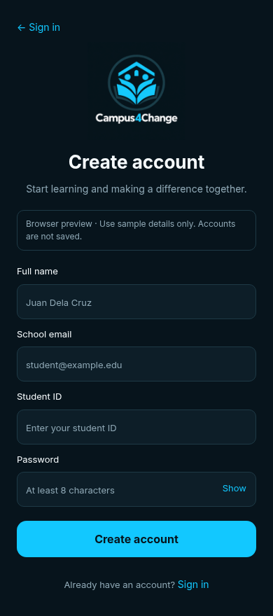

Figure 9b. Actual browser Sign Up screen.

Login contains an Email or Student ID field and a password field. Sign Up contains Full name, School email, Student ID and Password. Labels, autocomplete hints and a Show/Hide password control are provided.

Browser constraint validation checks required fields, the sign-up email format and a minimum eight-character registration password. Successful submission reports that the form was checked, then clears the fields. It does not create accounts, authenticate, store passwords or provide biometric sign-in. Only sample information should be entered.

# 10. Component Hierarchy and Navigation Scheme

```text
App
└── PhoneScreenLayout
    ├── SplashScreen
    ├── IntroSlideshow
    │   ├── IntroSlide
    │   ├── PageDots
    │   └── PrimaryButton
    └── AuthScreen (login / signup variants)
        └── PrimaryButton
```

App controls the visible route and splash timer. PhoneScreenLayout supplies the responsive frame. SplashScreen renders the logo and loading presentation. IntroSlideshow coordinates the three introductions. IntroSlide renders a single slide’s data. PageDots supplies reusable progress and slide selection. PrimaryButton supplies a consistent call to action. AuthScreen reuses one form layout for the login and signup variants.

```text
#/splash    → splash
#/intro/1   → Novice
#/intro/2   → Intermediate
#/intro/3   → Expert
#/login     → Login preview
#/signup    → Sign Up preview
```

Typical flow: Splash → Novice → Intermediate → Expert → Login ↔ Sign Up. Skip from Novice or Intermediate also opens Login. Back and clickable slide indicators allow returning to earlier introductions.

Reusability reduces duplication: changing the shared button updates all its consumers, changing IntroSlide updates all learning levels, and editing slides.js changes slide content without changing navigation logic. The browser prototype stays in splash-screen/ on the GitHub branch so it does not replace the native Android source.

# 11. AI Use, Verification and Submission Review

AI tool used: OpenAI Codex, with an OpenAI image-generation tool for the new logo. The groupmate-provided React project was the starting point. Codex assisted with logo integration, responsive CSS, hash navigation, sample form code, build checks, browser tests, screenshot capture and drafting this documentation.

AI assistance included actual code changes and report drafting, not only spelling correction. The group must review, understand and explain the code; verify the claims and design choices; and confirm that this scope of assistance follows the teacher’s “permitted but limited” AI policy. No unverified member-by-member contribution claims are included.

Verification performed: npm run lint passed; npm run build passed and generated dist/. Browser checks passed for the three-second splash transition, Next/Back/Skip/Get started navigation, login-to-signup navigation, browser history, required-field/email validation, password visibility and password clearing after valid submission. No runtime exceptions were observed in that test run.

Responsive verification covered six routes at four viewport sizes: 320×568, 390×844, 667×375 and 768×1024, for 24 screen-size combinations. The tests checked horizontal overflow and whether the final visible controls were reachable after scrolling. This is focused layout verification, not a comprehensive device, authentication or security test.

Before submission: add the three original Figma introduction screenshots immediately before their browser counterparts; confirm the revised logo and automatic splash transition with the group/teacher; review all text and actual contributions; and export the final reviewed document as PDF or submit a teacher-accessible document URL. This branch has not been submitted to Canvas by this workflow.

Sources: the teacher’s Laboratory Activity 4.1 instructions previously inspected in Canvas; the group’s supplied documentation cover format; current C4C_Splash project source; actual browser captures; and the original Figma splash screenshot (file i23zbYooPqV1EkTLXfnxMo, node 1:2). Figma’s connector limit prevented retrieval of the remaining original frames.

Activity: https://tip.instructure.com/courses/80483/assignments/3133919
Original prototype: https://www.figma.com/proto/i23zbYooPqV1EkTLXfnxMo/Campus4Change-Mobile-App-Prototype?node-id=1-2
GitHub branch: https://github.com/Patt-00/Campus4Change/tree/Splash-Screen

Conclusion: the prototype provides a working JavaScript React initialization, separated components, client-side routing, selected introductory interfaces and basic responsive behavior. The remaining documentation gap is the missing original-design evidence, not an implemented backend.
